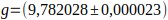

# *Dados do CSV*
---
m (Kg)  ; k1-L (m) ; k2-L (m) ; KP-L (m)
0.000 ; 0.1150 ; 0.1130 ; 0.2420
0.060 ; 0.1490 ; 0.1510 ; 0.3130
0.110 ; 0.1760 ; 0.1830 ; 0.3710
0.160 ; 0.2030 ; 0.2130 ; 0.4310
0.210 ; 0.2330 ; 0.2440 ; 0.4930
0.260 ; 0.2580 ; 0.2750 ; 0.5530

# *Delta x*

## Incerteza

$$
\sigma_{\Delta{x}}=\frac{0,004}{\sqrt{3}}\times\sqrt{2}=\pm0,0033m
$$

## Valores Principais
* 1.1 = 0,0340 m
* 1.2 = 0,0610 m
* 1.3 = 0,0880 m
* 1.4 = 0,1180 m
* 1.5 = 0,1430 m
* 2.1 = 0,0380 m
* 2.2 = 0,0700 m
* 2.3 = 0,1000 m
* 2.4 = 0,1310 m
* 2.5 = 0,1620 m
* s.1 = 0,0710 m
* s.2 = 0,1290 m
* s.3 = 0,1890 m
* s.4 = 0,2510 m
* s.5 = 0,3110 m

# *Objetivos*
* [x] Escreva o objetivo do experimento: Vamos calcular o valor teórico para Ks (mola 1 e mola 2 em série) a partir dos resultados das medições de k1 e k2, e comparar com o valor medido de Ks no experimento 

# *Hipoteses, aproximações e modelo de medição*
* [x] Hipóteses: O que se espera achar: Que o valor teórico de Ks seja compativel com o valor medido de Ks
* [x] Aproximações => gravidade do IBGE , conversão da massa para Kg e da dilatação ( $\Delta x$) para m
* [x] Modelo de medição 

---
$$
l(m) = l_0 + \frac{gm}{k}\text{, onde m é a massa, g a gravidade local, } l_0 \text{ é o comprimento inicial e } l\text{ é o comprimento medido}
$$
---
$$
k = \frac{g\times m}{\Delta x}\text{, onde m é a massa, g a gravidade local, } \Delta x \text{é a diferença entre o comprimento inicial e o comprimento medido}
$$
---

# *Analise de Resultados*
* [x] Escreva explicitamente a expressão da incerteza combinada no valor de k (uK) para o modelo de medição usado no cálculo das constantes elásticas da MOLA 1, MOLA 2 e ASSOCIAÇÃO EM SÉRIE.

---
$$
u_y = \sqrt{\sum^{n}_{i=1} [\frac{\partial F}{\partial x_i}]²\sigma_i²} \rightarrow u_k = \sqrt{(\frac{\partial{k}}{\partial{m}})^2\sigma_m^2 + (\frac{\partial{k}}{\partial{g}})^2\sigma_g^2 + (\frac{\partial{k}}{\partial{\Delta{x}}})^2\sigma_{\Delta{x}}^2} = \sqrt{(\frac{g}{\Delta{x}})^2\sigma_m^2 + (\frac{m}{\Delta{x}})^2\sigma_g^2 + (\frac{-mg}{\Delta{x}^2})^2\sigma_{\Delta{x}}^2} = \sqrt{\frac{g^2}{\Delta{x}^2}\sigma_m^2 + \frac{m^2}{\Delta{x}^2}\sigma_g^2 + \frac{m^2g^2}{\Delta{x}^4}^2\sigma_{\Delta{x}}^2} = \sqrt{\frac{g^2m^2}{\Delta{x}^2}(\frac{\sigma_m^2}{m^2} + \frac{\sigma_g^2}{g^2} + \frac{\sigma_{\Delta{x}}^2}{\Delta{x}^2})} = \frac{gm}{\Delta{x}}\sqrt{\frac{\sigma_m^2}{m^2} + \frac{\sigma_g^2}{g^2} + \frac{\sigma_{\Delta{x}}^2}{\Delta{x}^2}}
$$
---

# *Mola 1*
* [x] Escreva os valores de k1 obtidos para cada uma das cinco medições realizadas para a MOLA 1
* [ ] Analise dois a dois a compatibilidade dos resultados apresentados 
* [ ] Obtenha o valor de k1 resultante das medidas através do cálculo da média ponderada

* [x] k1.1 = (17,3 $\pm$ 1,7) N/m
* [x] k1.2 = (17,64 $\pm$ 0,96) N/m
* [x] k1.3 = (17,79 $\pm$ 0,67) N/m
* [x] k1.4 = (17,41 $\pm$ 0,49) N/m
* [x] k1.5 = (17,79 $\pm$ 0,41) N/m

## *Constante elástica*
### Caso 1
#### Incerteza
$$
u_{k1}=\frac{0,06000\times9,782028}{0,0340}\sqrt{(\frac{0,00058}{0,06000})^2 + (\frac{0,000023}{9,782028})^2 + (\frac{0,0033}{0,0340})^2}=1,7\frac{N}{m}
$$

#### Valor Principal
$$
k_1 = \frac{0,06000\times9,782028}{0,0340} = 17,3\frac{N}{m}
$$

### Caso 2
#### Incerteza
$$
u_{k2}=\frac{0,11000\times9,782028}{0,0610}\sqrt{(\frac{0,00058}{0,11000})^2 + (\frac{0,000023}{9,782028})^2 + (\frac{0,0033}{0,0610})^2}=0,96\frac{N}{m}
$$
#### Valor Principal
$$
k_2 = \frac{0,11000\times9,782028}{0,0610} = 17,64\frac{N}{m}
$$

### Caso 3
#### Incerteza
$$
u_{k3}=\frac{0,16000\times9,782028}{0,0880}\sqrt{(\frac{0,00058}{0,16000})^2 + (\frac{0,000023}{9,782028})^2 + (\frac{0,0033}{0,0880})^2}=0,67\frac{N}{m}
$$
#### Valor Principal
$$
k_3 = \frac{0,16000\times9,782028}{0,0880} = 17,79\frac{N}{m}
$$

### Caso 4
#### Incerteza
$$
u_{k4}=\frac{0,21000\times9,782028}{0,1180}\sqrt{(\frac{0,00058}{0,21000})^2 + (\frac{0,000023}{9,782028})^2 + (\frac{0,0033}{0,1180})^2}=0,49\frac{N}{m}
$$
#### Valor Principal
$$
k_4 = \frac{0,21000\times9,782028}{0,1180} = 17,41\frac{N}{m}
$$

### Caso 5
#### Incerteza
$$
u_{k5}=\frac{0,26000\times9,782028}{0,1430}\sqrt{(\frac{0,00058}{0,26000})^2 + (\frac{0,000023}{9,782028})^2 + (\frac{0,0033}{0,1430})^2}=0,41\frac{N}{m}
$$
#### Valor Principal
$$
k_5 = \frac{0,26000\times9,782028}{0,1430} = 17,79\frac{N}{m}
$$

## *Compatibilidade dois a dois*
### k1.1 e k1.2
---
$$
\frac{|k_{1.1} - k_{1.2}|}{\sqrt{(u_{k_{1.1}})^2+(u_{k_{1.2}})^2}} = \frac{|17,3 - 17,64|}{\sqrt{(1,7)^2+(0,96)^2}} = \leq 2,5 \rightarrow k_{1.1} \text{ e } k_{1.2} \text{ são compatíveis} 
$$
---
### k1.1 e k1.3
---
$$
\frac{|k_{1.1} - k_{1.3}|}{\sqrt{(u_{k_{1.1}})^2+(u_{k_{1.3}})^2}} = \frac{|17,3 - 17,79|}{\sqrt{(1,7)^2+(0,67)^2}} = \leq 2,5 \rightarrow k_{1.1} \text{ e } k_{1.3} \text{ são compatíveis} 
$$
---
### k1.1 e k1.4
---
$$
\frac{|k_{1.1} - k_{1.4}|}{\sqrt{(u_{k_{1.1}})^2+(u_{k_{1.4}})^2}} = \frac{|17,3 - 17,41|}{\sqrt{(1,7)^2+(0,49)^2}} = \leq 2,5 \rightarrow k_{1.1} \text{ e } k_{1.4} \text{ são compatíveis} 
$$
---
### k1.1 e k1.5
---
$$
\frac{|k_{1.1} - k_{1.5}|}{\sqrt{(u_{k_{1.1}})^2+(u_{k_{1.5}})^2}} = \frac{|17,3 - 0,2580|}{\sqrt{(1,7)^2+(0,41)^2}} = \leq 2,5 \rightarrow k_{1.1} \text{ e } k_{1.5} \text{ são compatíveis} 
$$
---
### k1.2 e k1.3
---
$$
\frac{|k_{1.2} - k_{1.3}|}{\sqrt{(u_{k_{1.2}})^2+(u_{k_{1.3}})^2}} = \frac{|17,64 - 17,79|}{\sqrt{(0,96)^2+(0,67)^2}} = \leq 2,5 \rightarrow k_{1.2} \text{ e } k_{1.3} \text{ são compatíveis} 
$$
---
### k1.2 e k1.4
---
$$
\frac{|k_{1.2} - k_{1.4}|}{\sqrt{(u_{k_{1.2}})^2+(u_{k_{1.4}})^2}} = \frac{|17,64 - 17,41|}{\sqrt{(0,96)^2+(0,0023)^2}} = \leq 2,5 \rightarrow k_{1.2} \text{ e } k_{1.4} \text{ são compatíveis} 
$$
---
### k1.2 e k1.5
---
$$
\frac{|k_{1.2} - k_{1.5}|}{\sqrt{(u_{k_{1.2}})^2+(u_{k_{1.5}})^2}} = \frac{|0,1760 - 0,2580|}{\sqrt{(0,0023)^2+(0,0023)^2}} = \leq 2,5 \rightarrow k_{1.2} \text{ e } k_{1.5} \text{ são compatíveis} 
$$
---
### k1.3 e k1.4
---
$$
\frac{|k_{1.3} - k_{1.4}|}{\sqrt{(u_{k_{1.3}})^2+(u_{k_{1.4}})^2}} = \frac{|0,2030 - 0,2330|}{\sqrt{(0,0023)^2+(0,0023)^2}} = \leq 2,5 \rightarrow k_{1.3} \text{ e } k_{1.4} \text{ são compatíveis} 
$$
---
### k1.3 e k1.5
---
$$
\frac{|k_{1.3} - k_{1.5}|}{\sqrt{(u_{k_{1.3}})^2+(u_{k_{1.5}})^2}} = \frac{|0,2030 - 0,2580|}{\sqrt{(0,0023)^2+(0,0023)^2}} = \leq 2,5 \rightarrow k_{1.3} \text{ e } k_{1.5} \text{ são compatíveis} 
$$
---
### k1.4 e k1.5
---
$$
\frac{|k_{1.4} - k_{1.5}|}{\sqrt{(u_{k_{1.4}})^2+(u_{k_{1.5}})^2}} = \frac{|0,2330 - 0,2580|}{\sqrt{(0,0023)^2+(0,0023)^2}} = \leq 2,5 \rightarrow k_{1.4} \text{ e } k_{1.5} \text{ são compatíveis} 
$$
---

* [ ] k1 = ( $\pm$ ) N/m

# *Mola 2*
* [ ] Escreva os valores de k2 obtidos para cada uma das cinco medições realizadas para a MOLA 2
* [ ] Analise dois a dois a compatibilidade dos resultados apresentados 
* [ ] Obtenha o valor de k2 resultante das medidas através do cálculo da média ponderada

* [ ] k2.1 = (0,1510 $\pm$ 0,0023) N/m
* [ ] k2.2 = (0,1830 $\pm$ 0,0023) N/m
* [ ] k2.3 = (0,2130 $\pm$ 0,0023) N/m
* [ ] k2.4 = (0,2440 $\pm$ 0,0023) N/m
* [ ] k2.5 = (0,2750 $\pm$ 0,0023) N/m

---

---

* [ ] k2 = ( $\pm$ ) N/m

# *Mola em série*
* [ ] Escreva os valores de ks obtidos para cada uma das cinco medições realizadas para a MOLA em serie
* [ ] Analise dois a dois a compatibilidade dos resultados apresentados 
* [ ] Obtenha o valor de ks resultante das medidas através do cálculo da média ponderada

* [ ] ks.1 = (0,3130 $\pm$ 0,0023) N/m
* [ ] ks.2 = (0,3710 $\pm$ 0,0023) N/m
* [ ] ks.3 = (0,4310 $\pm$ 0,0023) N/m
* [ ] ks.4 = (0,4930 $\pm$ 0,0023) N/m
* [ ] ks.5 = (0,5530 $\pm$ 0,0023) N/m

---

---

* [ ] ks = ( $\pm$ ) N/m

# *Equações*
* [ ] Escreva explicitamente a expressão da incerteza combinada no valor de k (uK) para o modelo de medição que calcula kS em temos de k1 e k2 obtidos anteriormente

---

---

* [ ] Escreva o valor de kS obtido através dos valores de k1 e k2
* [ ] ks = ( $\pm$ ) N/m

* [ ] Faça o teste de compatibilidade entre os valores de kS obtidos experimentalmente e por cálculo a partir de k1 e k2.

# *Conclusão*
* [ ] Faça a conclusão
